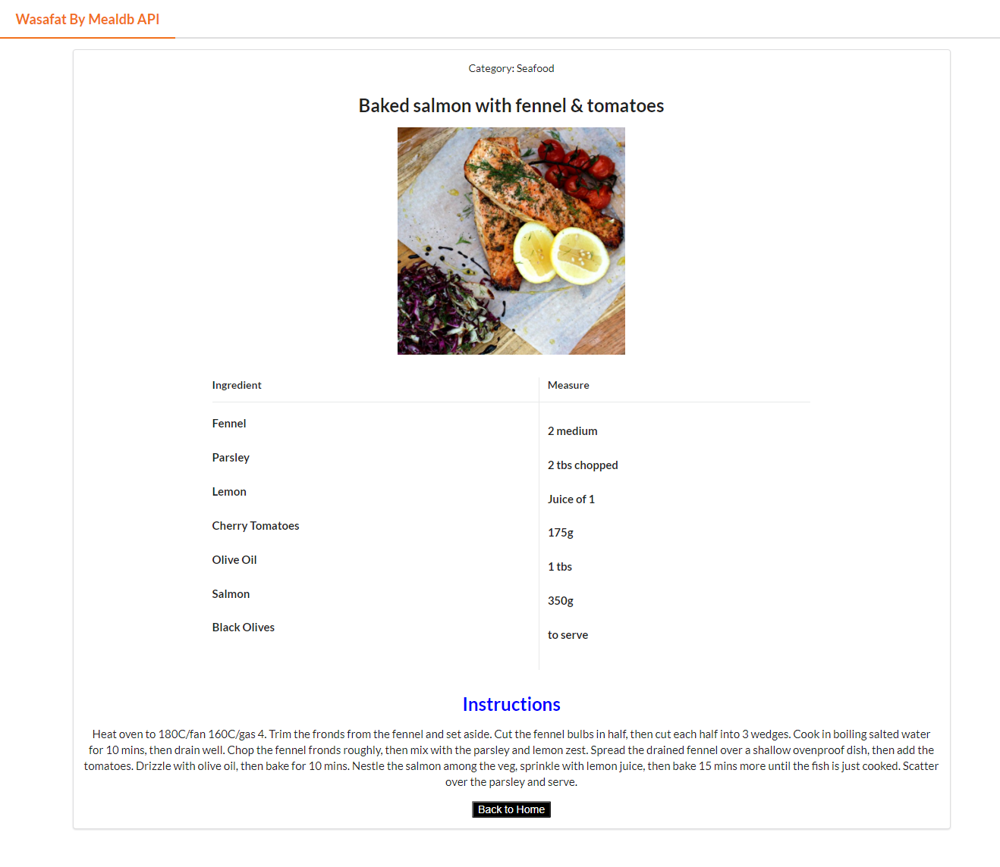

# React Capstone Project.
- After finishing the curiculum of react, we are supposed to do a final Project to show our gained knowledge.

# food-wasafat.

- Is a REACT App the porpose of it is to create a food recipe app with APi, that fetsh the food category + ingredients (WASAFAT) is an arabic dialect wich it means in English recipes.

# Live demo link

- 

# Screenshot of the Project

# Loom Video link

- 

## In this project.

- React & Redux.
- TheMealDB API.
- Linters.
- Workflow.
- Netlify for deploy.

# How it's work.

- Go to [Github repo food wasafat](https://github.com/dasileker/food-wasafat/).

- Clone the repo: [https://github.com/dasileker/food-wasafat.git].

- Cd to the cloned repo.

- Open the terminal and type: npm install.

- YAY, now you can type npm start to see the work.

# Author
## **Zerradi Amine**

- Github [@dasileker](https://www.github.com/dasileker).
- LinkedIn [@LinkedIn](https://www.linkedin.com/in/amine-zerradi).
- Twitter [@dasileker](https://www.twitter.com/dasileker).

## Feedback

 - Give A  thumb-up 👍 if you like it.

 ## License 

 - This project is MIT license